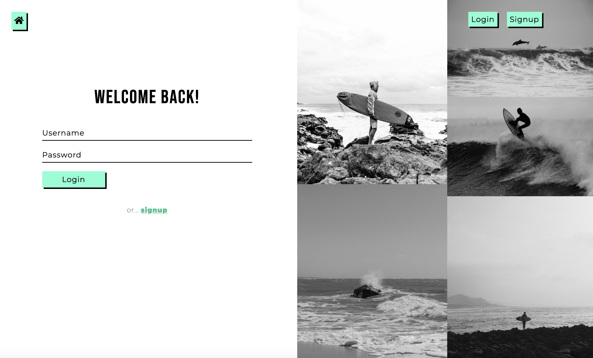
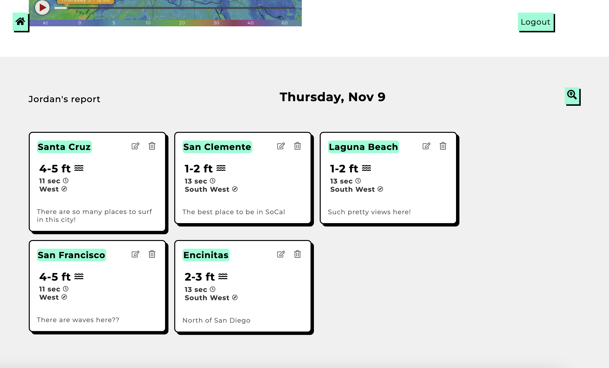

# Surf Report

[explore the site here!](https://floating-shelf-66988-88c62d989e6d.herokuapp.com/)

## Description

Surf Report is a full stack application inspired by Surfline. Here you can create your own surf reports and monitor wind conditions with integrated third party APIs. Feel free to create your own account and start exploring!

## Usage
Login or Signup, then click on the Search icon, fill out the form and monitor conditions!
 
 

## Technologies

- React
- React Hooks -- useEffect, useState, useContext
- JavaScript
- CSS
- Node
- Express
- Express Sessions (with Cookies)
- MySQL (with Sequelize) 
- Bcrypt (for password hashing)
- GeoCoding API (converting city names into Latitude and Longitude) [GeoCoding Website](https://api-ninjas.com/api/geocoding)
- Windy API (built in Interactive map and for converting  Latitude and Longitude into surf condition data) [Windy.com](https://api.windy.com/)

## Installation

(must have Node and MySQL2 installed)
 
 
1: Clone this repository to your local machine
 
2: Change Directory into the `db` folder then into `schema.sql` and run `mysql -u root -p` in your terminal
 
3: Enter your MySQL2 password and run `source schema.sql` to setup the database
 
4: Create a .env file with the following credentials: `DB_NAME=surf_db`, `DB_USER=your_username_here`, `DB_PASSWORD=your_password_here`
 
5: Change Directory into the root of the project and run `npm install` then `npm run develop`
 

 That's it!

## Questions
For questions about the project, you can reach me via:
- GitHub: [Lopez-Jordan](https://github.com/Lopez-Jordan)
- Email: jordanlopezemail@gmail.com

## License
This application is covered under the MIT license.
